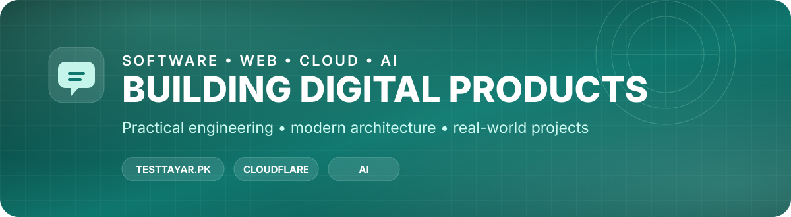

<div align="center">



<h1>Muhammad Sami</h1>

<p>
  <strong>Software Engineer • Web Developer • Cloud & AI Enthusiast</strong>
</p>

<p>
  I build practical web products, experiment with AI, and enjoy turning ideas into usable tools.
</p>

<p>
  <a href="https://testtayar.pk"></a>
  <a href="https://github.com/sami2515"></a>
</p>

</div>

---

## About Me

I'm **Muhammad Sami**, a developer focused on building clean, useful, and scalable digital products.

My current interests sit around:

- Web applications and product development
- Cloudflare-based infrastructure
- TypeScript and modern frontend architecture
- AI-assisted development and practical AI tooling
- Developer tooling, automation, and performance

I prefer building things that solve a real problem rather than technology for technology's sake.

---

## Featured Project

### TestTayar.pk

**TestTayar.pk** is an independent study platform built for candidates preparing for government-job tests.

It focuses on:

- Typing practice
- MCQ practice
- Daily drills
- Job-specific preparation
- Readiness tracking
- Leaderboards and streaks
- Guides and exam resources

**Stack:** `SvelteKit` · `TypeScript` · `Tailwind CSS` · `Cloudflare Workers` · `Cloudflare D1` · `Cloudflare R2`

<a href="https://testtayar.pk">
  
</a>

---

## Tech Stack

### Languages & Core

<p>
  
</p>

### Frontend & Application Development

<p>
  
</p>

### Cloud & Infrastructure

<p>
  
</p>

### Data & Tools

<p>
  
</p>

---

## What I'm Building

```text
┌─────────────────────────────────────────────────────────────┐
│  PRODUCT        →  Build useful tools for real users        │
│  WEB            →  Fast, responsive, modern interfaces      │
│  CLOUD          →  Edge-first and cost-conscious systems    │
│  AI             →  Practical AI, automation & experiments   │
│  LEARNING       →  Keep improving through real projects     │
└─────────────────────────────────────────────────────────────┘
```

---

## GitHub Activity

<p align="center">
  
  
</p>

<p align="center">
  
</p>

---

## Contribution Graph

<p align="center">
  
</p>

---

## Currently Exploring

`AI Engineering` · `Cloudflare Workers` · `Edge Computing` · `Automation` · `Developer Experience` · `Modern Web Architecture`

---

## Let's Connect

<p>
  <a href="https://github.com/sami2515">
    
  </a>
  <a href="https://testtayar.pk">
    
  </a>
</p>

---

<div align="center">


<sub>Building. Learning. Shipping.</sub>

</div>


### Contribution Snake

After the included GitHub Action runs, the contribution snake will be published to the repository's `gh-pages` branch.
